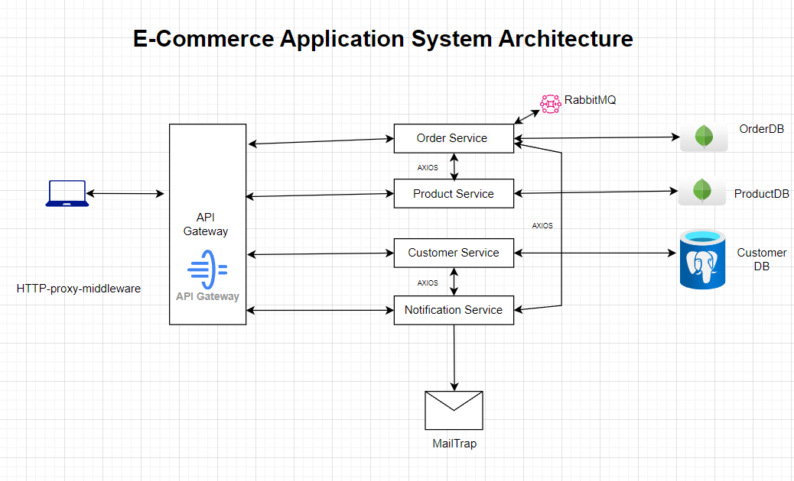

# **E-Commerce Application Project**

This repository contains a suite of microservices designed to work together as part of a larger system. Each service is responsible for a specific set of functionalities and can be scaled independently. Below is an overview of each service along with the technology stack used.

## Services Overview

#### API Gateway

NestJS, http-proxy-middleware, PostgreSQ, pg library, JWT (JSON Web Token)

#### Order Service

NestJS, MongoDB, AuthGuard, RabbitMQ, Swagger

#### Product Service

NestJS, MongoDB, AuthGuard, Interceptors, Pipes, Swagger

#### Customer Service

NestJS, TypeORM, PostgreSQL, AuthGuard, Swagger

#### Notification Service

Express.js, Mailtrap, Nodemailer

## Installation

```bash
$ npm install
```

## Running the app

```bash
# development
$ npm run start

# watch mode
$ npm run start:dev

# production mode
$ npm run start:prod
```

## Test

```bash
# unit tests
$ npm run test

# e2e tests
$ npm run test:e2e

# test coverage
$ npm run test:cov
```
